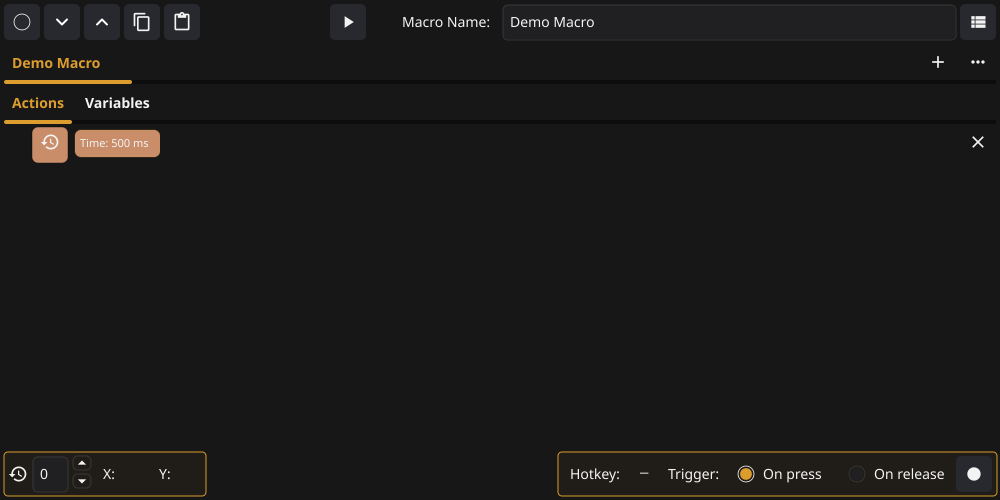
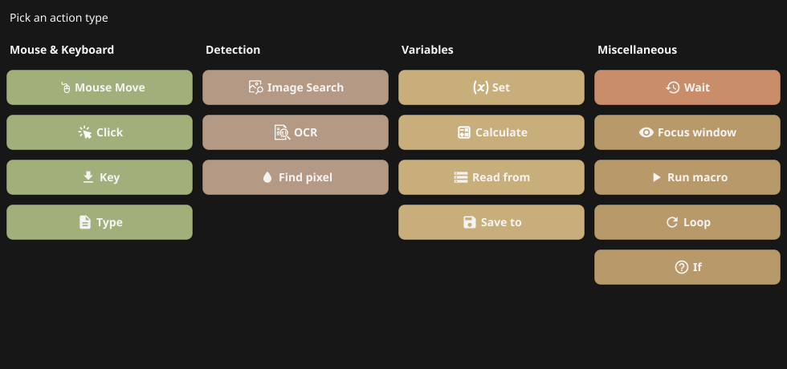
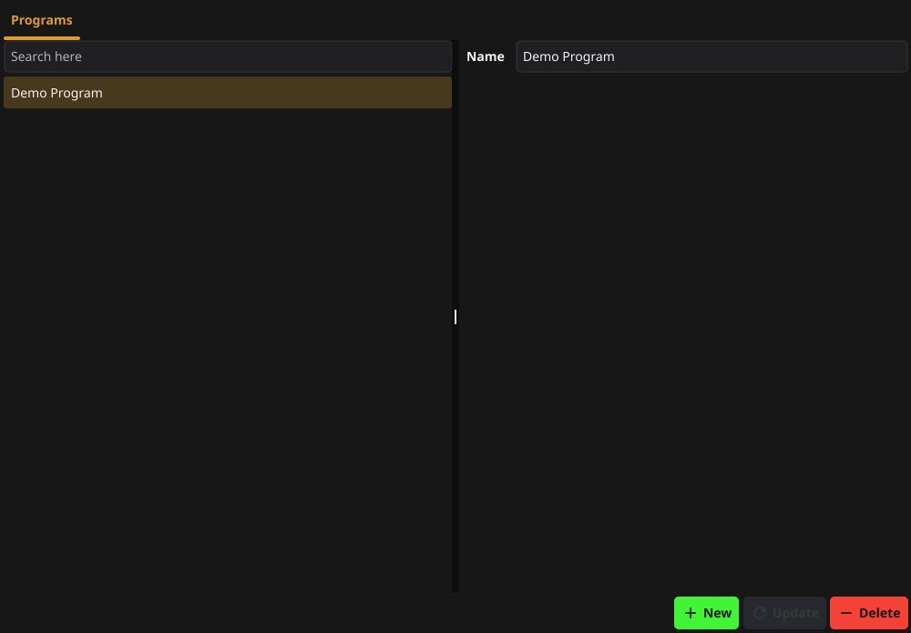
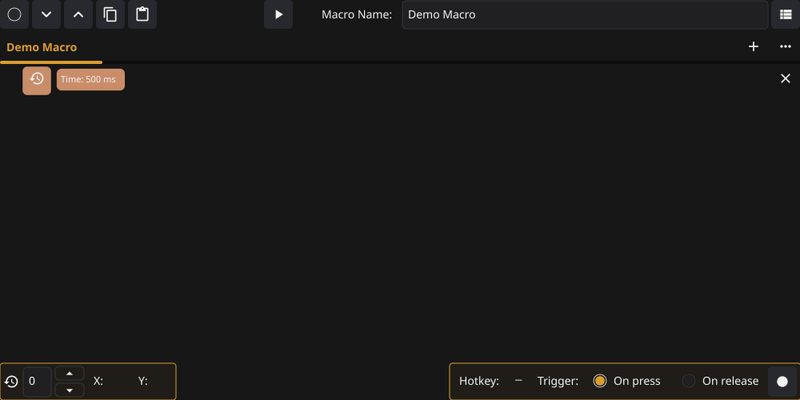

<p align="center">
  
</p>

<h1 align="center">Sqyre</h1>

<p align="center">
  <strong>Desktop macro builder</strong> for automating clicks, keys, waits, and screen-based steps — with image search and OCR when you need to react to what’s on screen.
</p>

---

## Features

- **Visual macro tree** — Organize automation as a tree: one root **loop**, branches for advanced flows (**loop**, **image search**, **OCR**), and leaf actions for concrete steps.
- **Mouse automation** — **Click** at the cursor, **move** to coordinates.
- **Keyboard** — **Key** actions with up/down state control.
- **Timing** — **Wait** for a chosen number of milliseconds.
- **Image search** — Find a template on screen (OpenCV-backed) and drive clicks or flow from matches.
- **OCR** — Read on-screen text with Tesseract (via gosseract) for conditions or data-driven steps.
- **Cross-platform** — Linux and Windows builds supported (see [Developer setup](#developer-setup)); primary workflow uses the dev container for reproducible builds.

Stack highlights: [Fyne](https://fyne.io/) (GUI), [robotgo](https://github.com/go-vgo/robotgo) (automation), [gocv](https://gocv.io/) / OpenCV (vision), [gosseract](https://github.com/otiai10/gosseract) / Tesseract (OCR).

---

## Usage

1. **Build or install** a binary for your OS (see [Developer setup](#developer-setup)).
2. **Launch Sqyre** and use the tree to add a **loop** at the root, then add **actions** under it.
3. **Configure** each node (coordinates, keys, delays, image paths, OCR regions, etc.) using the UI.
4. **Run** your macro from the app when you’re ready.

The tree mirrors how macros are structured in code: the root loop drives repetition; **image search** and **OCR** branches help when the next step depends on the screen; leaf actions are the atomic steps (**click**, **move**, **key**, **wait**).

---

## Examples

Screenshots and GIFs are generated from automated UI tests. Regenerate with:

```bash
./scripts/generate-docs-media.sh
```

### Main window



### Add action picker



### Action dialogs

Each action type has its own edit panel:

| Category | Actions |
|----------|---------|
| Mouse & Keyboard | [Move](docs/images/action-dialog-move.png) · [Click](docs/images/action-dialog-click.png) · [Key](docs/images/action-dialog-key.png) · [Type](docs/images/action-dialog-type.png) |
| Detection | [Image Search](docs/images/action-dialog-imagesearch.png) · [OCR](docs/images/action-dialog-ocr.png) · [Find pixel](docs/images/action-dialog-findpixel.png) |
| Variables | [Set](docs/images/action-dialog-setvariable.png) · [Calculate](docs/images/action-dialog-calculate.png) · [For each row](docs/images/action-dialog-foreachrow.png) · [Save to](docs/images/action-dialog-savevariable.png) |
| Miscellaneous | [Wait](docs/images/action-dialog-wait.png) · [Focus window](docs/images/action-dialog-focuswindow.png) · [Run macro](docs/images/action-dialog-runmacro.png) · [Loop](docs/images/action-dialog-loop.png) |

### Data editor



### Building a macro (animated)



To verify committed assets match the current UI in CI, run:

```bash
go test -v ./ui/ -run 'TestDocsScreenshots|TestDemoWorkflowFrames'
```

(Use `./scripts/test-ui.sh` on headless machines — it wraps `xvfb-run`.)

---

## Developer setup

**Recommended:** open the repo in the **dev container** (dependencies and OpenCV are aligned with what the app expects).

### Linux

From the dev container (repository root):

| Goal | Command |
|------|---------|
| Debug / dev binary | `make linux` → `./bin/sqyre` (override build tags with `BUILD_TAGS=...`) |
| AppImage | `make appimage` |
| Tesseract data helper | `make tessdata` / `./scripts/download-tessdata.sh` |

For **Flatpak** or **AppImage** details, see [scripts/linux/packaging/PACKAGING.md](scripts/linux/packaging/PACKAGING.md).

OpenCV is built with the helper scripts [scripts/linux/build-opencv-linux.sh](scripts/linux/build-opencv-linux.sh) and [scripts/windows/build-opencv-windows.sh](scripts/windows/build-opencv-windows.sh); Android-oriented notes live in [scripts/android/README-opencv.md](scripts/android/README-opencv.md). The dev container [Dockerfile](.devcontainer/Dockerfile) is the reference for Linux dependency versions.

<details>
<summary>no devcontainer (not up to date)</summary>

1. **Install dependencies** (Debian/Ubuntu-style example):

   ```bash
   sudo apt install -y \
     build-essential pkg-config cmake golang-go \
     tesseract-ocr libtesseract-dev libleptonica-dev \
     libgl1-mesa-dev libglvnd-dev libglfw3-dev \
     libxkbcommon-dev libxkbcommon-x11-dev \
     libx11-dev libx11-xcb-dev libxext-dev libxtst-dev \
     libxcursor-dev libxrandr-dev libxinerama-dev \
     libxxf86vm-dev libxt-dev \
     libjpeg-dev libpng-dev libtiff-dev libwebp-dev libopenjp2-7-dev
   ```

2. **OpenCV** — Sqyre uses **gocv**; OpenCV **≥ 4.6** is required. Build or install to match gocv’s expectations; see `.devcontainer/Dockerfile` and `scripts/linux/build-opencv-linux.sh` for a concrete recipe.

3. **Build:** `go build -o sqyre ./cmd/sqyre`

</details>

### Windows
```bash
make windows
```

<details>
<summary>no devcontainer (not up to date)</summary>

Using the **mingw64** shell in [MSYS2](https://www.msys2.org/):

1. **Install packages** — e.g. [mingw-w64-x86_64-toolchain](https://packages.msys2.org/groups/mingw-w64-x86_64-toolchain), [mingw-w64-x86_64-opencv](https://packages.msys2.org/package/mingw-w64-x86_64-opencv), [mingw-w64-x86_64-tesseract-ocr](https://packages.msys2.org/package/mingw-w64-x86_64-tesseract-ocr), [mingw-w64-x86_64-leptonica](https://packages.msys2.org/package/mingw-w64-x86_64-leptonica), plus [mingw-w64-x86_64-go](https://packages.msys2.org/package/mingw-w64-x86_64-go?repo=mingw64) if you build Go inside MSYS2.

2. **Tesseract English data** — Download [eng.traineddata](https://github.com/tesseract-ocr/tessdata/blob/main/eng.traineddata) into `C:\msys64\mingw64\share\tessdata` and set `TESSDATA_PREFIX=C:/msys64/mingw64/share/tessdata` in mingw64.

3. **Optional Go env (MSYS2 Go)** — `export GOROOT=/mingw64/lib/go` and `export GOPATH=/mingw64`.

4. **Build:** `go build -o sqyre.exe ./cmd/sqyre`

VS Code + MSYS2: [integrate the mingw64 shell](https://stackoverflow.com/questions/45836650/how-do-i-integrate-msys2-shell-into-visual-studio-code-on-windows).

</details>

### UI tests (Linux)

`robotgo` needs an X display. In headless CI or SSH sessions, use:

```bash
./scripts/test-ui.sh
./scripts/test-ui.sh -run TestGUI
```

Executor action tests use a recording backend (no real mouse/keyboard) and run as part of `./scripts/test-ui.sh` or `go test ./internal/services/ -run TestExecute`.

Regenerate README screenshots and the demo GIF:

```bash
./scripts/generate-docs-media.sh
```

Set `SQYRE_UPDATE_SCREENSHOTS=1` when adding new golden screenshots; CI compares committed PNGs to fresh captures.

### GoCV `Mat` profiling (leak detection)

Build with the **matprofile** tag to track `gocv.Mat` allocations and spot unclosed Mats. Logs go to **`~/.sqyre/sqyre.log`** (Windows: `%USERPROFILE%\.sqyre\sqyre.log`). A pprof HTTP server starts on `127.0.0.1:6060` (or the next free port in 6061–6065); the log prints the exact URL — open **gocv.io/x/gocv.Mat** in the browser for stack traces.

| Platform | Command |
|----------|---------|
| Linux | `go build -tags "gocv_specific_modules,matprofile" -o sqyre ./cmd/sqyre` |
| Windows (from dev container) | `make windows-matprofile` or `./scripts/windows/build-matprofile.sh` |

Optional env: **`SQYRE_PPROF=0`** disables pprof; **`SQYRE_PPROF=127.0.0.1:9090`** sets a fixed port (adjust firewall on Windows if the browser cannot connect).

### License

Sqyre is licensed under the **GNU General Public License v3.0** — see [LICENSE](LICENSE).

---

## Donations

If Sqyre saves you time, consider supporting development:

- monero
- `85rMS89cS9M8w8cD7ByC1EVXqenx9VBooakM46MLFptN8aRr3uojqfFPUNapWjTk3DPKZy5hadwN6UoGYrt5c7qkTqVWKdU`
- [Buy Me A Coffee]()
- **[GitHub Sponsors — @luhrMan](https://github.com/sponsors/luhrMan)**