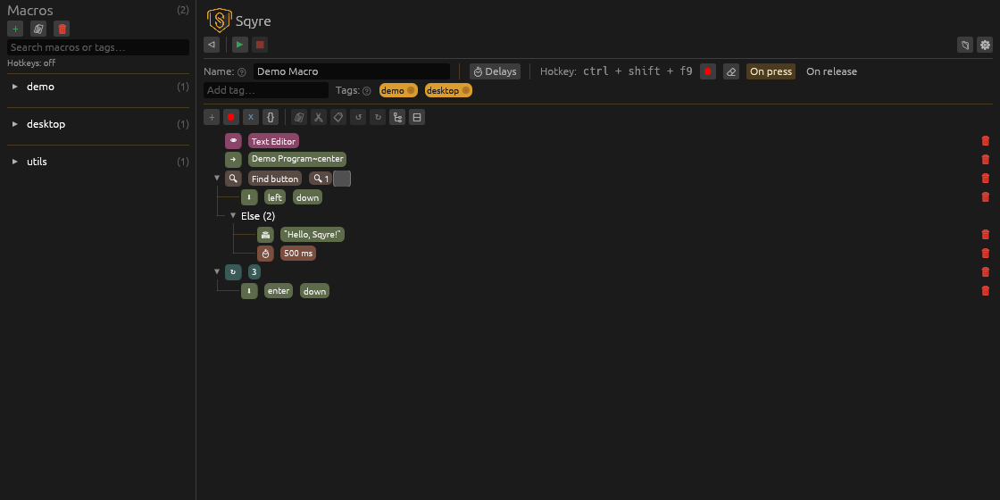
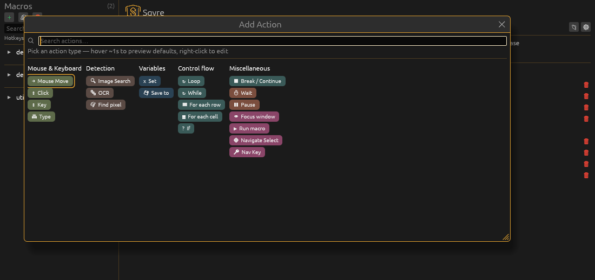
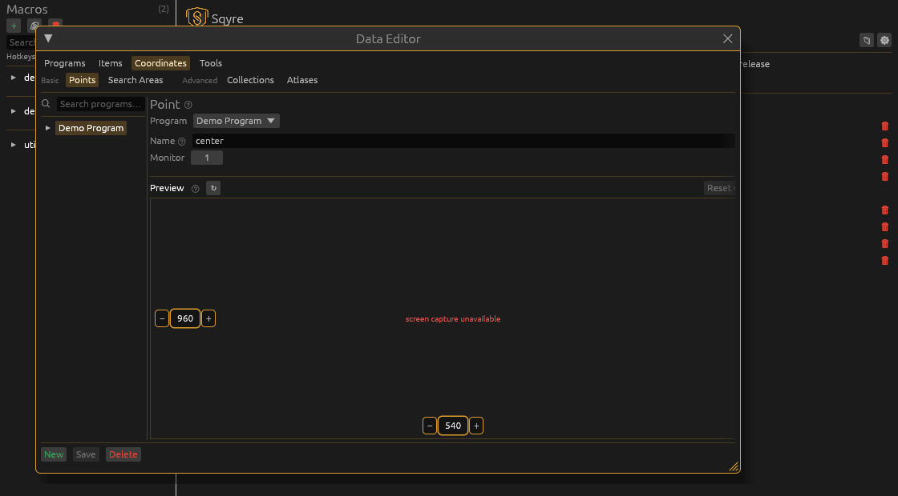
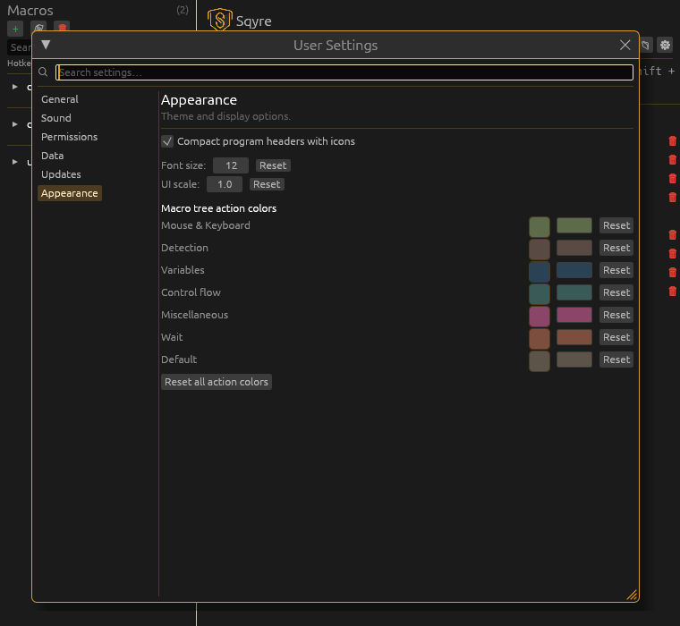
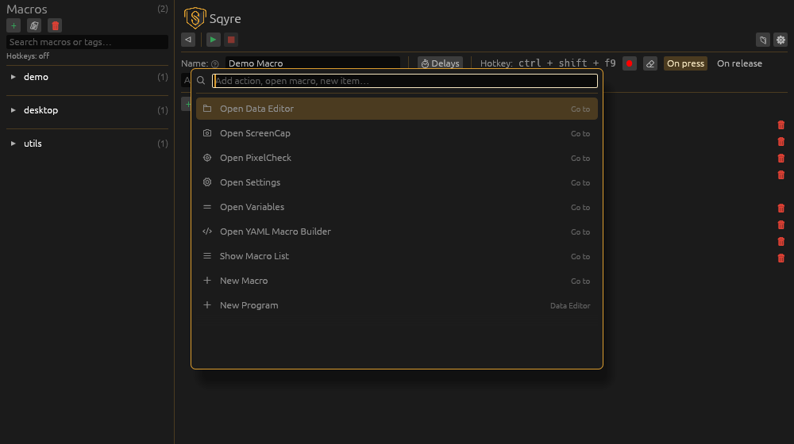

  

<h1 align="center">Sqyre</h1>

  <strong>Desktop macro builder</strong> — automate mouse, keyboard, and screen-aware steps with a visual tree editor.

---

## What it does

Sqyre lets you build and run macros without writing code. Each macro is a tree of actions: loops and branches for flow control, detection steps when the screen matters, and leaf actions for concrete input. Macros, images, masks, and data tables live under **`~/.sqyre/`** (config in `db.yaml`).

**Platforms:** Linux desktop is shipped on **X11** and **Wayland** (portal ScreenCast / RemoteDesktop + EIS where the session supports them; Permissions settings in-app). Windows `.exe` is released (GDI capture, window focus, selection outline, hotkeys, tray; no MSI). macOS capture/focus and macOS releases are not shipped yet. WASM editor zip is released for browser editing (no Run / capture / OCR).

---

## Actions

| Category | Actions |
|----------|---------|
| **Mouse & keyboard** | Move, click, key, type |
| **Detection** | Image search (PureCV; multi-variant icons), OCR (Tesseract), find pixel — optional wait-until-found |
| **Variables** | Set (values + expressions), save to file or clipboard |
| **Control flow** | Loop, while, break/continue, for each row, if |
| **Miscellaneous** | Wait, pause, focus window, run macro, navigate select/key |

**Also in the app:**

- **Data editor** — programs, items (with icon variants), masks, points, search areas, collections, atlases; ScreenCap and PixelCheck tools; on-screen **overlay buttons** (drag-relocate while the Overlay tab is open)
- **Command palette** (Ctrl+K) — jump to macros, add actions, open editor tabs
- **Macro recording** — capture moves, clicks, keys, and waits, then review / copy into a tree
- **Hotkeys** — press or release, tag-scoped macros, persistent tag filter on the macro list
- **System tray** — hide / show the main window
- Zip backups of `~/.sqyre/`; in-app auto-update from GitHub Releases (Linux/Windows); global delay per macro; runtime variable panel while a macro runs

**Stack:** [egui](https://github.com/emilk/egui) · PureCV · Tesseract (`leptess`).

---

## Usage

1. **Build** — `make` (see [Developing](docs/DEVELOPING.md)).
2. **Launch** `./bin/sqyre` — or `make run`.
3. **Create a macro** — the root is always a **loop**; add child actions from the picker or the command palette.
4. **Configure** each node in its pinned in-tree tooltip editor (coordinates, keys, templates, OCR regions, variables, etc.), picking reusable points, search areas, and images from entity pickers.
5. **Run** from the toolbar, a **hotkey**, an **overlay button**, or after **recording** a sequence.

Branching actions (**image search**, **OCR**, **find pixel**, **if**) run child steps only when their condition matches. **Loop** / **while** / **for each row** repeat children; **break / continue** controls those loops.

---

## Screenshots

Assets under `docs/images/` are generated from in-memory egui tests (`make docs-media`).

| | |
|---|---|
| Main window |  |
| Add action picker |  |
| Data editor |  |
| Settings |  |
| Command palette |  |

---

## Build (quick start)

**Recommended:** open the repo in the **dev container** — Rust, Tesseract/Leptonica, and X11 link deps are preinstalled.

| Goal | Command |
|------|---------|
| Linux binary (default) | `make` / `make sqyre` → `./bin/sqyre` |
| Run without installing | `make run` |
| Release binary | `make release` |
| Windows / macOS native | `make windows` → `./bin/sqyre.exe` (Docker cross on Linux) · `make macos` → `./bin/sqyre` |
| AppImage | `make appimage` |
| WASM editor | `make wasm` → `bin/wasm/` |
| Tests | `make test` |
| README screenshots | `make docs-media` |
| Tesseract data (dev fallback) | `make tessdata` |

Override with `CARGO_FLAGS=...`.

More detail — workspace layout, host setup, packaging — is in **[docs/DEVELOPING.md](docs/DEVELOPING.md)**, **[docs/RUST.md](docs/RUST.md)**, and **[docs/README.md](docs/README.md)**.

---

## License

Sqyre is licensed under the **GNU General Public License v3.0** — see [LICENSE](LICENSE).

---

## Donations

If Sqyre saves you time, consider supporting development:

- **Monero:** `85rMS89cS9M8w8cD7ByC1EVXqenx9VBooakM46MLFptN8aRr3uojqfFPUNapWjTk3DPKZy5hadwN6UoGYrt5c7qkTqVWKdU`
- **[GitHub Sponsors — @luhrMan](https://github.com/sponsors/luhrMan)**
