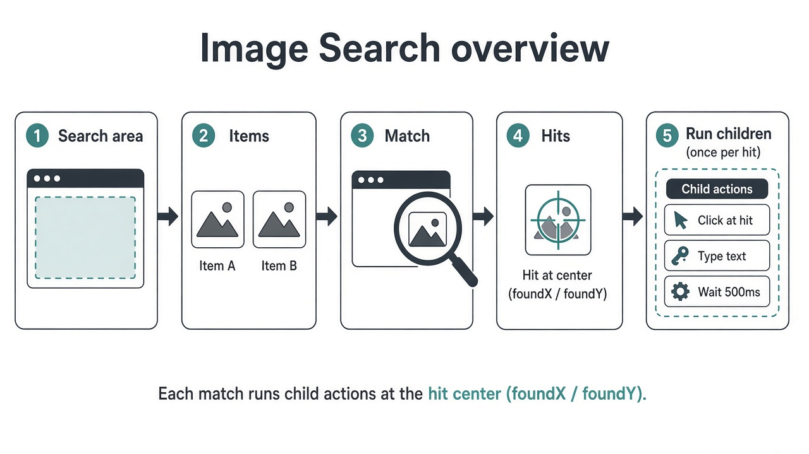
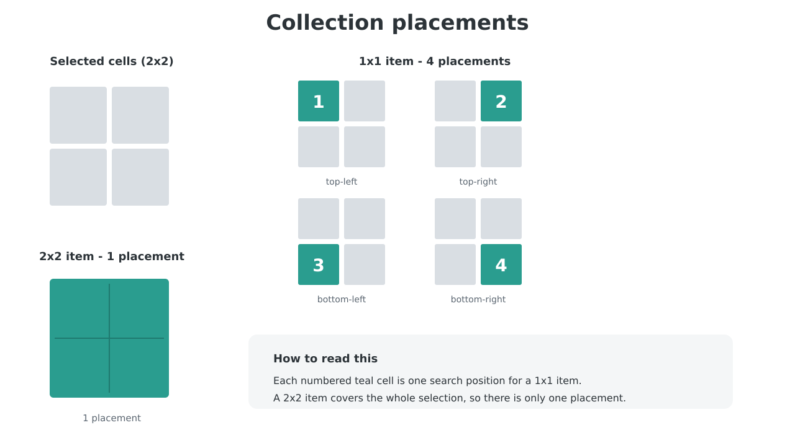
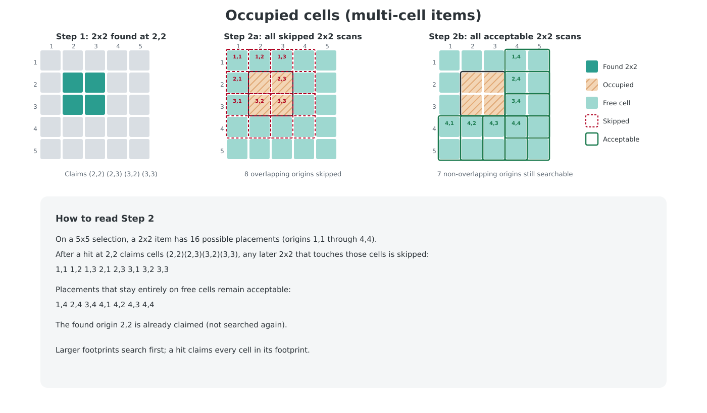
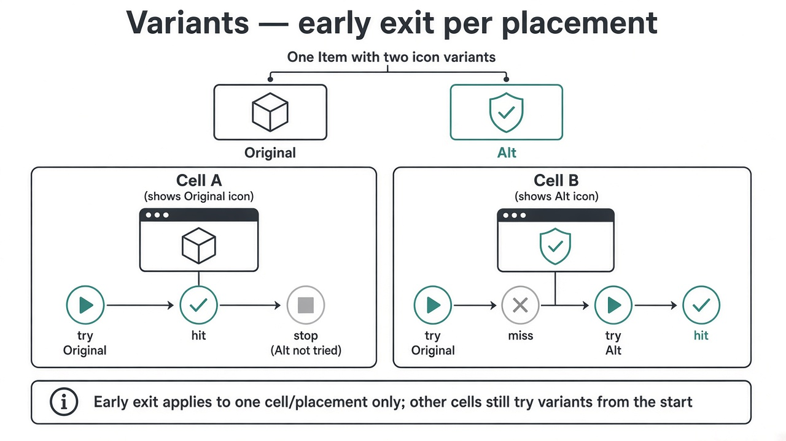

# Image Search

Image Search looks for catalog **Items** inside a **Search area**, then runs nested child actions once per match. Match coordinates are the **center** of the found icon and are written to **Output X** / **Output Y** (defaults `foundX` / `foundY`).



## Items and variants

In the action, **Items** is the list of catalog templates to look for (`Program~Item`).

In the Data Editor, each item has:

| Setting | Role |
|---------|------|
| **Original** | Default icon file (first variant) |
| **Icon variants** | Extra looks (`Item~Alt.png`, …) |
| **Cols** / **Rows** | How many collection cells this item occupies (0 counts as 1) |
| **Stack max** | Catalog stack size (exposed as `StackMax` on a hit) |
| **Mask** | Optional mask applied during matching |

On a hit, builtin variables include `ItemName`, `VariantName` (empty for Original), `Cols`, `Rows`, `StackMax`, and template pixel size.

## Search area

**Search area** comes from the Data Editor and is one of:

1. **Desktop region** — a named screen rectangle. The whole capture is searched once per item.
2. **Collection cell range** — `Program~Collection@r1,c1-r2,c2` (1-based, inclusive). Only those cells are captured; matching uses **placements** (below).

## Collection grids and placements

A **Collection** has its own search bounds plus a **Rows** × **Cols** grid. When Image Search targets a cell range on that collection, Sqyre slides each item’s footprint through the selection **one cell at a time**. Each slide position is a **placement** (the pixel union of the covered cells).



Examples on a selected 2×2 block:

- **1×1 item** → 4 placements (every cell)
- **2×2 item** → 1 placement (the whole block)
- Footprint larger than the selection → no placements → that item is skipped

Straddling a cell boundary does not count: a 1×1 search only accepts icons that sit inside one placement’s cells.

## Occupied cells (multi-cell items)

On a **collection** search with multiple items, Sqyre treats cells as single-occupant slots:

1. Items with **larger footprints** (`rows × cols`) are searched first (ties break by name).
2. When a placement finds a match, **every cell in that footprint is claimed**.
3. Later items skip any placement that overlaps claimed cells.
4. Overlapping placements of the **same** item are also resolved so one hit cannot double-claim the same cells.



Example on a **5×5** selection: a found **2×2** at origin `2,2` claims `(2,2)`, `(2,3)`, `(3,2)`, and `(3,3)`.

- **Skipped** later 2×2 origins (overlap that block): `1,1` `1,2` `1,3` `2,1` `2,3` `3,1` `3,2` `3,3`
- **Acceptable** later 2×2 origins (stay on free cells): `1,4` `2,4` `3,4` `4,1` `4,2` `4,3` `4,4`

That keeps large icons from losing their slots to overlapping footprints.

## Variants and early exit

Variants of one item are tried **in order** (Original, then named alts). As soon as one variant hits on a given search, remaining variants for **that** search stop.

Early exit is **per placement** on collections, and **per full-frame search** on desktop regions. Finding Original in one cell does **not** skip Alt on another cell.



## Tolerance, blur, and method

| Setting | Meaning |
|---------|---------|
| **Tolerance** | How closely the screen must match the icon (threshold depends on **Method**) |
| **Blur** | Softens both screen and template before matching (helps with noise / slight scale) |
| **Method** (Advanced) | Correlation mode; default is normalized coefficient matching |

## Wait and repeat

**Repeat mode** (shared with OCR / Find Pixel):

| Mode | Behavior |
|------|----------|
| **Once** | Single attempt |
| **Wait until found** | Poll quietly until a hit (or timeout), then run children once |
| **Wait while found** | Poll while still visible, then run once |
| **Repeat until found** | Run children each pass until found |
| **Repeat while found** | Run children each pass while found |

Related fields: **Wait seconds**, **Interval ms**, **Max iterations** (repeat modes).

## Multiple hits, order, and Else

- Children under Image Search run **once per hit**, in **Match order** (Advanced: row/column grouping and left/right, top/bottom direction).
- **Output X** / **Output Y** update on each hit; after the loop they settle on the **first** hit’s coordinates.
- **Else** runs when there are **no** matches (coordinate outputs are cleared).

## Quick mental model

```
Capture Search area
        ↓
For each Item (large footprints first on Collections)
        ↓
  For each free placement (or one full frame)
        ↓
    Try variants until one hits  →  claim cells (Collections)
        ↓
Sort hits → run children per hit  (or Else if none)
```
